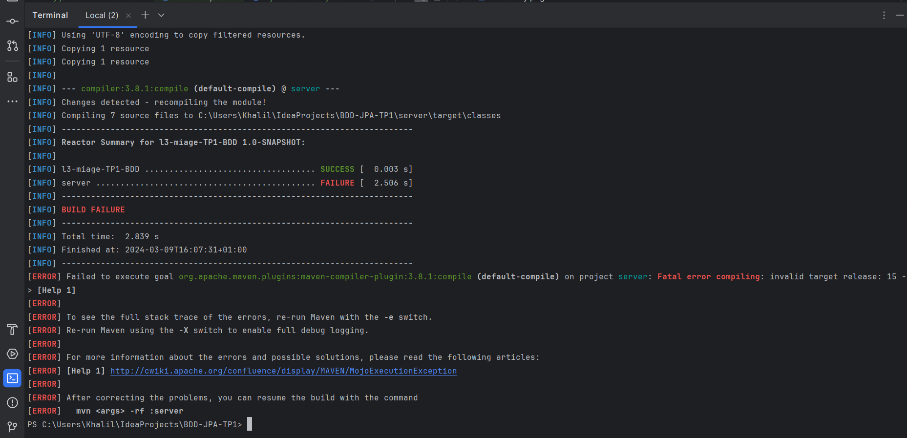

    Compte rendu TP1
    Created by KHALIL IBRAHIM

    Exo1
Une question : En lançant la commande mvn test à l'étape 1.7 de l'exo1, je tombe sur cette erreur et j'aimerais comprendre le problème associé :
